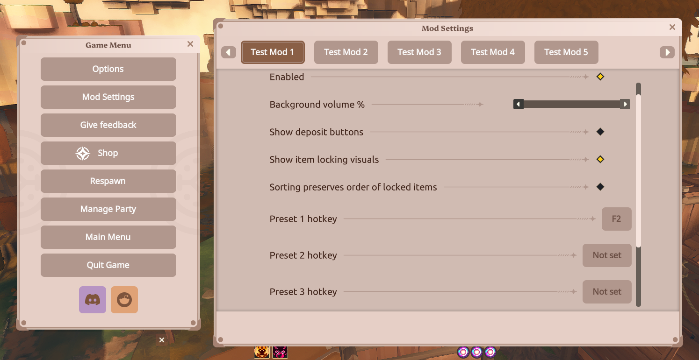

# Better Mod Settings

[Builds](https://github.com/xWink/farever-mods/actions/workflows/build-better-mod-settings.yml) · [Releases](https://github.com/xWink/farever-mods/releases?q=better-mod-settings&expanded=true)

Adds a **Mod Settings** button to Farever's Game Menu and presents compatible mods' settings in a native game window.



## Installation

Download the mod with Vortex on [NexusMods](https://www.nexusmods.com/farever/mods/10).

## For developers: How to make a mod compatible with Better Mod Settings

A compatible mod needs:

1. An HLX native settings file at `hlx/config/<mod-name>/config.json`.
2. A `configFormats.json` descriptor beside the mod's `.hl` file.
3. A Better Mod Settings bus subscription so the running mod reloads its settings immediately after an edit.

The files use these locations:

```text
hlx/mods/example-mod/example-mod.hl
hlx/mods/example-mod/configFormats.json
hlx/config/example-mod/config.json
```

### 1. Create the settings file

Declare your settings with `@:hlx.config` and call `config.save()` on startup to write the initial defaults. HLX loads saved values automatically and fills in missing defaults. Better Mod Settings edits the resulting JSON object. Each exposed setting must be a top-level property whose JSON type matches its control:

```json
{
  "enabled": true,
  "volume": 50,
  "actionHotkey": 0
}
```

The settings file must exist before the Mod Settings window opens and must contain valid JSON. It may contain additional properties that are not exposed in the UI; Better Mod Settings preserves them when saving. For older mods, it falls back to `hlx/mods/<mod-name>/config.json` only when the native file does not exist.

### 2. Add `configFormats.json`

Create `configFormats.json` beside the mod's `.hl` file and describe the controls in the order they should appear:

```json
{
  "schemaVersion": 1,
  "displayName": "Example Mod",
  "configs": [
    {
      "key": "enabled",
      "type": "checkbox",
      "label": "Enabled"
    },
    {
      "key": "volume",
      "type": "slider",
      "label": "Volume %",
      "min": 0,
      "max": 100,
      "step": 1
    },
    {
      "key": "actionHotkey",
      "type": "keybinding",
      "label": "Action hotkey"
    }
  ]
}
```

#### Top-level options

| Option | Required | Type | Behavior and limitations |
| --- | --- | --- | --- |
| `schemaVersion` | Recommended | Number | Use `1`. The current reader reserves this field for format evolution but does not reject or branch on it yet. |
| `displayName` | No | String | Name shown on the mod's tab. Defaults to the mod folder name. Tabs are sorted alphabetically by this value. |
| `configs` | Yes | Array | Control definitions. Items are displayed in array order. |

#### Options shared by every control

| Option | Required | Type | Behavior and limitations |
| --- | --- | --- | --- |
| `key` | Yes | String | Exact top-level property name in the settings JSON. An empty key is ignored; nested paths are not supported. |
| `type` | Yes | String | Must be exactly `checkbox`, `slider`, or `keybinding`. Other values do not create a usable control. |
| `label` | No | String | Text displayed beside the control. Defaults to `key`. |

#### Control types

| `type` | Settings value | Extra descriptor options | Limitations |
| --- | --- | --- | --- |
| `checkbox` | Boolean (`true` or `false`) | None | Represents a boolean only. A missing value is displayed as `false`. |
| `slider` | Number | `min` (default `0`), `max` (default `100`), and `step` (default `1`), all numbers | Supply sensible bounds with `min <= max` and a positive `step`. A missing value starts at `min`. |
| `keybinding` | Integer key code | None | Captures one `hxd.Key`-compatible key only. Modifier combinations and multi-key chords are not supported. `0` means **Not set**. Escape cancels capture and cannot be assigned through the UI. |

The current format does not provide text inputs, dropdowns, buttons, color pickers, nested objects, groups, conditional controls, or settings that span multiple JSON properties.

### 3. Subscribe to live setting changes

Better Mod Settings writes the updated JSON first, then publishes a notification on:

```text
better-mod-settings/config-changed/<mod-folder-name>
```

Subscribe with the mod's runtime module name so it automatically matches the installed folder:

```haxe
import hlx.runtime.Bus;
import hlx.runtime.ModConfig;

typedef ExampleConfig = {
    var enabled:Bool;
    var volume:Int;
    var actionHotkey:Int;
}

@:build(hlx.runtime.Mod.build())
class ExampleMod {
    @:hlx.config
    static var config:ExampleConfig = {
        enabled: true,
        volume: 50,
        actionHotkey: 0
    };

    static function main():Void {
        config.save();
        Bus.subscribe(
            "better-mod-settings/config-changed/" + HlxRuntime.moduleName(),
            (_:Dynamic) -> {
                config = ModConfig.load(HlxRuntime.moduleName(), config);
                applyConfig(); // Optional: apply runtime side effects here.
            }
        );
    }

    static function applyConfig():Void {}
}
```

If the mod already has a `main()`, save the initial configuration and add the `Bus.subscribe(...)` call there. The event payload is intentionally unused: the JSON file remains the source of truth, so the callback should reload it unconditionally. Do not save the old in-memory values from this callback, because that would overwrite the user's edit.

Build against a current [HLX runtime](https://github.com/hlx-framework/hlx-core) with `@:hlx.config` support. Bus notifications require HLX Core `0.0.7` or newer. If other objects retain a reference to your settings, copy the loaded fields into that object instead of replacing it. Without the subscription, Better Mod Settings can still edit the file, but the mod must poll the file or wait until its next load/restart to observe the change.

## Building

Requires [HLX Core](https://github.com/hlx-framework/hlx-core) and the Farever `hl-imgui` library.

```sh
cd better-mod-settings
haxe compile.hxml
```
