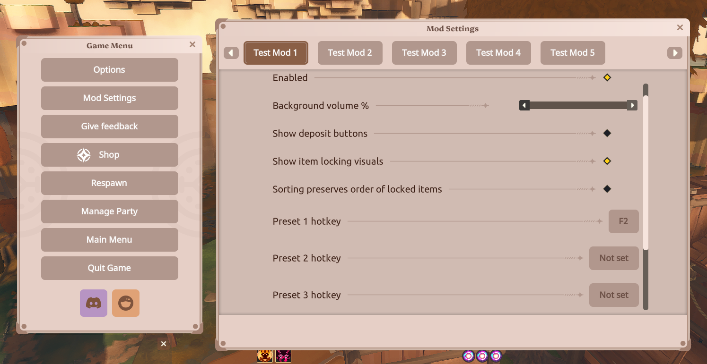

# Better Mod Settings

[Builds](https://github.com/xWink/farever-mods/actions/workflows/build-better-mod-settings.yml) · [Releases](https://github.com/xWink/farever-mods/releases?q=better-mod-settings&expanded=true)

Adds a **Mod Settings** button to Farever's Game Menu and presents compatible mods' settings in a native game window.



## Installation

Download the mod with Vortex on [NexusMods](https://www.nexusmods.com/farever/mods/10).

## For developers: How to make a mod compatible with Better Mod Settings

A compatible mod needs:

1. An HLX native settings file at `hlx/config/<mod-name>/config.json`.
2. A `configFormats.json` descriptor beside the mod's `.hl` file.
3. Bus subscriptions for setting changes and any action buttons the mod exposes.

The files use these locations:

```text
hlx/mods/example-mod/example-mod.hl
hlx/mods/example-mod/configFormats.json
hlx/config/example-mod/config.json
```

### 1. Create the settings file

Declare your settings with `@:hlx.config` and call `config.save()` on startup to write the initial defaults. HLX loads saved values automatically and fills in missing defaults. Better Mod Settings edits the resulting JSON object. Each exposed setting must be a top-level property whose JSON type matches its control:

```json
{
  "enabled": true,
  "volume": 50,
  "actionHotkey": 0,
  "customText": "Hello"
}
```

The settings file must exist before the Mod Settings window opens and must contain valid JSON. It may contain additional properties that are not exposed in the UI; Better Mod Settings preserves them when saving. For older mods, it falls back to `hlx/mods/<mod-name>/config.json` only when the native file does not exist.

### 2. Add `configFormats.json`

Create `configFormats.json` beside the mod's `.hl` file and describe the titles and controls in the order they should appear:

```json
{
  "schemaVersion": 1,
  "displayName": "Example Mod",
  "configs": [
    {
      "type": "title",
      "label": "General"
    },
    {
      "key": "enabled",
      "type": "checkbox",
      "label": "Enabled"
    },
    {
      "key": "volume",
      "type": "slider",
      "label": "Volume %",
      "min": 0,
      "max": 100,
      "step": 1
    },
    {
      "key": "actionHotkey",
      "type": "keybinding",
      "modifiers": true,
      "label": "Action hotkey"
    },
    {
      "key": "customText",
      "type": "text",
      "label": "Custom text",
      "placeholder": "Enter text"
    },
    {
      "key": "clockTimerMode",
      "type": "dropdown",
      "label": "Show clock/timer",
      "options": ["None", "Rift timer", "Clock"]
    }
  ]
}
```

#### Top-level options

| Option | Required | Type | Behavior and limitations |
| --- | --- | --- | --- |
| `schemaVersion` | Recommended | Number | Use `1`. The current reader reserves this field for format evolution but does not reject or branch on it yet. |
| `displayName` | No | String | Name shown on the mod's tab. Defaults to the mod folder name. Tabs are sorted alphabetically by this value. |
| `configs` | Yes | Array | Title and control definitions. Items are displayed in array order. |

#### Titles

Use a title to introduce a section:

```json
{ "type": "title", "label": "Combat" }
```

A title displays larger, bold text on its own row, without a separator or control. Long titles wrap within the settings body. It requires only a non-empty `label`; no `key` or settings JSON property is needed, and it does not save a value or publish setting-change notifications.

#### Options shared by every control

| Option | Required | Type | Behavior and limitations |
| --- | --- | --- | --- |
| `key` | Yes | String | Exact top-level property name in the settings JSON, or the action identifier for a button. An empty key is ignored; nested paths are not supported. Button keys must be unique within the mod. |
| `type` | Yes | String | Must be exactly `checkbox`, `slider`, `text`, `dropdown`, `keybinding`, or `button` for a control. Use `title` for a display-only title row as described above. |
| `label` | For dropdowns | String | Text displayed beside the control. Dropdowns require a non-empty label; other controls default to `key`. |
| `tooltip` | No | Object | Set `enabled` to `true` and supply a non-empty string `tooltipText` to add a circled question mark immediately after the label. Hover the icon to display the help text. |

```json
{
  "key": "showBossHealth",
  "type": "checkbox",
  "label": "Show boss health",
  "tooltip": {
    "enabled": true,
    "tooltipText": "Boss health bars will show the raw health value alongside percentage. Instead of just \"100%\", you will see \"150,000 (100%)\""
  }
}
```

Tooltips are optional for every control type. They appear only over the help icon;
the label and setting keep their usual behavior. Text is literal (no markup).

#### Control types

| `type` | Settings value | Extra descriptor options | Limitations |
| --- | --- | --- | --- |
| `checkbox` | Boolean (`true` or `false`) | None | Represents a boolean only. A missing value is displayed as `false`. |
| `slider` | Number | `min` (default `0`), `max` (default `100`), and `step` (default `1`), all numbers | Supply sensible bounds with `min <= max` and a positive `step`. A missing value starts at `min`. |
| `text` | String | `placeholder` (default `""`) | Native single-line text field. Saves on each edit, including clearing to `""`, and publishes the usual config-change notification. BMS preserves the text exactly: no trimming, parsing, validation, or conversion to numbers/booleans. Missing or non-string values display as empty. Long text scrolls within the field. Placeholder text is only a hint and is never saved. |
| `dropdown` | String | `options` (required, non-empty array of strings) | Native dropdown displaying options in the supplied order. Selecting an option saves its exact string, not its index, and publishes the usual config-change notification. A missing or unrecognized value displays the first option without writing the config merely by opening settings. Invalid descriptors are skipped and logged. |
| `keybinding` | Integer key code, or `{ "code": 49, "modifier": 0 }` | Optional `modifiers: true` | Left-click to assign a key; right-click the assignment button to unbind it. Opted-in controls also accept one Ctrl, Shift, or Alt modifier, using Farever's key eligibility and modifier priority. `0` means **Not set**. Escape cancels capture. All hotkey activation stays suppressed until the assignment keys and modifiers have been released. |
| `button` | None | `buttonText`, `colour`, `warning` | Sends an action event. No matching settings JSON property is needed or written. See below. |

Modifier support is opt-in so existing third-party mods continue receiving integer
keys. Set `"modifiers": true` only after updating the consumer to accept both a
legacy integer and a Farever-style `{ "code": keyCode, "modifier": modifier }`
object. Modifier values are **0 = Ctrl**, **1 = Shift**, and **2 = Alt**. Plain keys
retain their integer format; modified left-click uses code `0` inside an object.
Consumers must check both the key and modifier; passing the object to
`hxd.Key.isPressed` is not supported. The shared `modinput.Hotkey` and
`modinput.NativeHotkey` helpers in this repository provide normalization, labels,
and polling. Custom hotkeys use Farever's strict modifier matching, so `Ctrl+1`
does not also activate an unmodified `1` hotkey.

Hold the modifier and press the main key when assigning a combination. Tapping a
modifier by itself binds that key. Like Farever, modifier combinations work with
letters, number-row and numpad digits, F1–F24, Enter, Tab, arrow keys, and left/right
mouse buttons. Other keys keep their single-key behavior. Only one modifier is
stored; if several are held, Farever's priority is Ctrl, then Shift, then Alt.


Key capture consumes keyboard and mouse-button events centrally, before `hxd.Key.onEvent` publishes them. BMS clears the previously published key state when the picker opens and keeps assignment input private. Native game actions and mods polling `hxd.Key.isPressed`, `isDown`, or `isReleased` (including inlined reads) therefore see no assignment input; they do not need individual capture guards. After assignment or Escape cancellation, protection remains until all keys/buttons are released and a quiet frame passes. The assigned key must be pressed again to activate its action. Closing the settings window cancels an unfinished assignment; leaving the game clears capture state. This covers Farever's key-state API, not separate operating-system or ImGui input backends.

Mods interpret and validate text values themselves; for example, a mod can expose a hex colour as a string setting. Opening the settings window does not save or normalize text values.

The current format does not provide color pickers, nested settings values, collapsible groups, conditional controls, or settings that span multiple JSON properties.

#### Action buttons

```json
{
  "key": "resetPresets",
  "type": "button",
  "label": "Reset presets",
  "buttonText": "Reset",
  "colour": "red",
  "warning": {
    "enabled": true,
    "warningText": "Delete all saved presets?"
  }
}
```

| Option | Default | Behavior |
| --- | --- | --- |
| `buttonText` | `label`, falling back to `key` | Text inside the button; `label` is the separate row label. |
| `colour` | `"default"` | `"default"` preserves native styling. `"green"` and `"red"` use the game's palette with hover/press feedback. Omitted or unknown colours use the default. |
| `warning.enabled` | `false` | Only boolean `true` opens a native confirmation popup before the action. |
| `warning.warningText` | `"Are you sure you want to continue?"` | Popup message. Empty or omitted text uses the default. The popup title is the row label. |

The popup has **Continue** and **Cancel** buttons. Continue sends the event once; Cancel, Escape, closing the popup/settings, or leaving the session sends nothing. The initial click never sends a warned action. Only one confirmation can be pending at a time.

Subscribe once during mod startup to the button's named event:

```haxe
Bus.subscribe(
    "better-mod-settings/action/" + HlxRuntime.moduleName() + "/resetPresets",
    (_:Dynamic) -> resetPresets()
);
```

The last segment is the exact descriptor `key`. Payload is `null`; no settings value is written and no `config-changed` event is sent for a button. BMS publishes each accepted click once at the end of the game update, after queued configuration-change notifications. Distinct clicks are not combined. The subscriber performs the action and saves its own changes when needed; keep handlers short and schedule longer work through the mod's update loop. Events are transient, so subscribe before the player uses the button. A mod exposing only buttons can create an empty `{}` settings file to satisfy discovery.

### 3. Subscribe to live setting changes

Better Mod Settings writes the updated JSON first, then publishes a notification on:

```text
better-mod-settings/config-changed/<mod-folder-name>
```

Subscribe with the mod's runtime module name so it automatically matches the installed folder:

```haxe
import hlx.runtime.Bus;
import hlx.runtime.ModConfig;

typedef ExampleConfig = {
    var enabled:Bool;
    var volume:Int;
    var actionHotkey:Dynamic;
}

@:build(hlx.runtime.Mod.build())
class ExampleMod {
    @:hlx.config
    static var config:ExampleConfig = {
        enabled: true,
        volume: 50,
        actionHotkey: 0
    };

    static function main():Void {
        config.save();
        Bus.subscribe(
            "better-mod-settings/config-changed/" + HlxRuntime.moduleName(),
            (_:Dynamic) -> {
                config = ModConfig.load(HlxRuntime.moduleName(), config);
                applyConfig(); // Optional: apply runtime side effects here.
            }
        );
    }

    static function applyConfig():Void {}
}
```

If the mod already has a `main()`, save the initial configuration and add the `Bus.subscribe(...)` call there. The event payload is intentionally unused: the JSON file remains the source of truth, so the callback should reload it unconditionally. Do not save the old in-memory values from this callback, because that would overwrite the user's edit.

Build against a current [HLX runtime](https://github.com/hlx-framework/hlx-core) with `@:hlx.config` support. Bus notifications require HLX Core `0.0.7` or newer. If other objects retain a reference to your settings, copy the loaded fields into that object instead of replacing it. Without the subscription, Better Mod Settings can still edit the file, but the mod must poll the file or wait until its next load/restart to observe the change.

## Building

Requires Haxe 4.3.7 and the [HLX runtime](https://github.com/hlx-framework/hlx-core).

```sh
cd better-mod-settings
haxe compile.hxml
```

## Regression checks

Run `haxe test.hxml` from `better-mod-settings/`. CI checks assignment, cancellation, held/repeated input, release events, multiple updates per frame, consecutive assignments, focus loss, and disposal before packaging. The central-input tests also simulate a raw consumer with no polling hooks or capture guard, both before and after a binding reload, plus pre-held keys, fast taps, mouse buttons, and wheel pulses. The native event handler and array methods are checked against the supplied live and PTR bytecode.

Action checks cover descriptor defaults, colour values, mod-specific routing, confirmation/cancellation, repeated and stale callbacks, and session disposal. Unbinding checks cover right-click during capture and its consumed release. Native dialog, button, and style entry points are verified against live and PTR bytecode; visual confirmation still requires in-game testing.

Confirmation button lists are allocated through the game's native `ArrayObj.slice`
and populated with `pushDyn`. The dialog API requires `ArrayObj`; passing a mod's
`Array<Dynamic>` directly produces `ArrayDyn` and fails before the popup opens.

Text tests run on the interpreter and HashLink. The HashLink test reproduces the native string identity mismatch, checks that values serialize as JSON strings, and covers Unicode, whitespace, empty input, numeric-looking text, reopening, and malformed old records.
